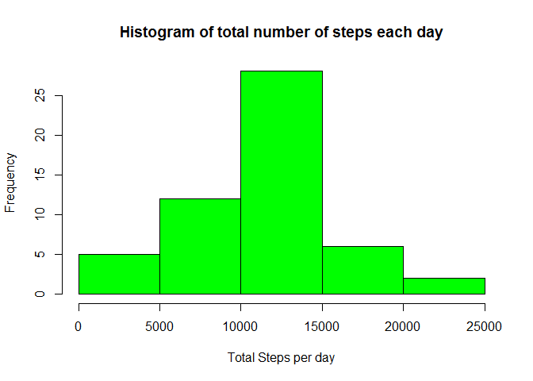
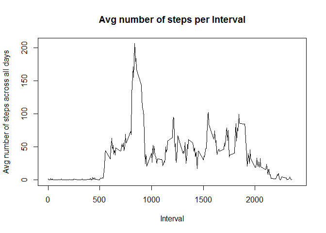
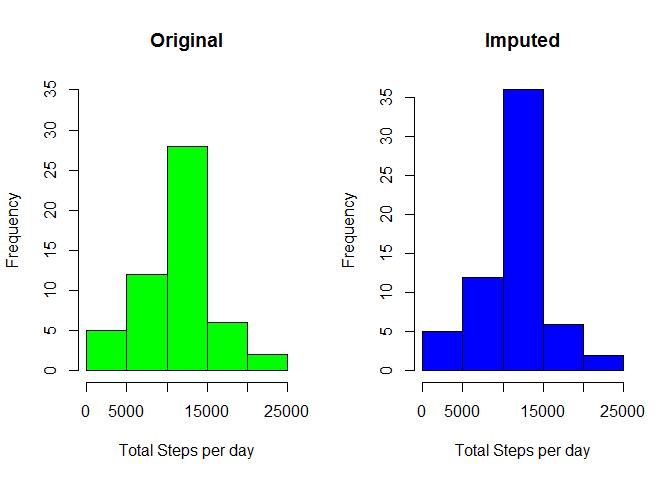
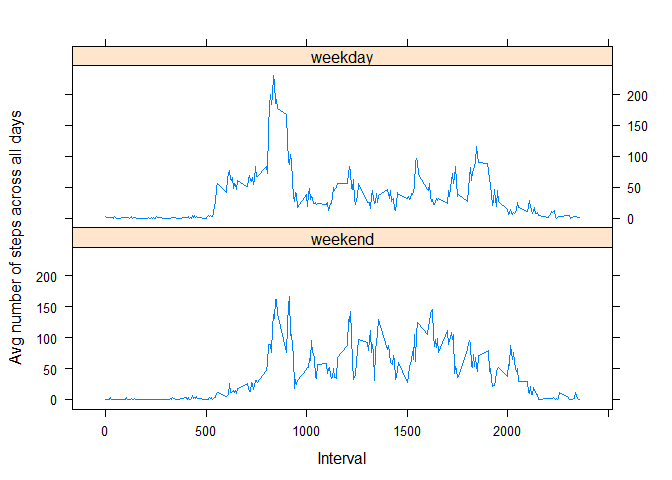

# Reproducible Research: Peer Assessment 1


##Initial Setup.  

Load default options for code chunks. 


```r
library(knitr)
opts_chunk$set(echo=TRUE)
```

Load data into R. This assumes that the activity.csv file is located in same directory 


```r
activity<- read.csv("./activity.csv", )
library(dplyr)
```

```
## 
## Attaching package: 'dplyr'
## 
## The following objects are masked from 'package:stats':
## 
##     filter, lag
## 
## The following objects are masked from 'package:base':
## 
##     intersect, setdiff, setequal, union
```

```r
library(xtable)
library(lattice)
```


## Section 1: What is mean total number of steps taken per day?

- **Calculate the total number of steps taken per day**

Get the total number of steps per day by :  
  1. Removing observatios with NA values in Steps variable.  
  2. Group data by date variable.  
  3. summarize data.  
  4. Store results in totalsteps data frame.  


```r
totalsteps<- select(activity[!is.na(activity$steps),], -interval) %>% group_by(date) %>%   summarize_each(funs(sum))
```


- **If you do not understand the difference between a histogram and a barplot, research the difference between them. Make a histogram of the total number of steps taken each day.  **

Here's a histogram of the total number of steps each day.


```r
hist(totalsteps$steps, col="green", xlab="Total Steps per day", 
     main="Histogram of total number of steps each day")
```

 


- **Calculate and report the mean and median of the total number of steps taken per day.   **

Compute for the mean of the total number of steps taken per day.


```r
meantotal <- mean(totalsteps$steps)
print(meantotal)
```

```
## [1] 10766.19
```

Compute for the median of the total number of steps taken per day.


```r
mediantotal<- median(totalsteps$steps)
print(mediantotal)
```

```
## [1] 10765
```


## What is the average daily activity pattern?

- **Make a time series plot (i.e. type = "l") of the 5-minute interval (x-axis) and the average number of steps taken, averaged across all days (y-axis)**  

Prepare data per time interval averaged across all days, then generate time series plot. 


```r
avgstepsperinterval <- select(activity[!is.na(activity$steps),],-date) %>% group_by(interval) %>%   summarize_each(funs(mean))

plot(avgstepsperinterval$interval, avgstepsperinterval$steps, type="l", main="Avg number of steps per Interval", xlab="Interval", ylab="Avg number of steps across all days", xlim=c(0,2400 ))
```

 

- ** Which 5-minute interval, on average across all the days in the dataset, contains the maximum number of steps? **  

Get the interval of the observation with the highest average steps.


```r
maxstep<- max(avgstepsperinterval$steps)
intervalofmax<- avgstepsperinterval[avgstepsperinterval$steps==maxstep,1]

print (intervalofmax)
```

```
## Source: local data frame [1 x 1]
## 
##   interval
##      (int)
## 1      835
```

Above shows the maximum value of average step is 206.1698113 which is measured at the interval 835. 


## Imputing missing values

- **Note that there are a number of days/intervals where there are missing values (coded as NA). The presence of missing days may introduce bias into some calculations or summaries of the data.**

- **Calculate and report the total number of missing values in the dataset (i.e. the total number of rows with NAs)**

Compute the total number of rows where steps is NA. 


```r
sum(is.na(activity$steps))
```

```
## [1] 2304
```


- **Devise a strategy for filling in all of the missing values in the dataset. The strategy does not need to be sophisticated. For example, you could use the mean/median for that day, or the mean for that 5-minute interval, etc.**  

- **Create a new dataset that is equal to the original dataset but with the missing data filled in.**  

Will use the mean for the 5-minute interval across all days to populate the NA values.  
Below code does the following:  
1. Merges activity and avgstepsperinterval data frames, to be able to copy the interval average.  
2. Fix the variable names after the merge.  
3. For observations with NA values in "steps" variable, assign the average value.  
4. Drop the average steps column to make the dataset equal to the original, but with missing data filled in.  


```r
activitynew<- merge(activity, avgstepsperinterval, by.x = "interval", by.y="interval" )
names(activitynew)[2] <- "steps"
names(activitynew)[4] <- "avgsteps"

activitynew[is.na(activitynew$steps),2] <- activitynew[is.na(activitynew$steps),4]
activitynew <- select(activitynew, -avgsteps)

sum(is.na(activitynew$steps))
```

```
## [1] 0
```

- **Make a histogram of the total number of steps taken each day and Calculate and report the mean and median total number of steps taken per day. Do these values differ from the estimates from the first part of the assignment? What is the impact of imputing missing data on the estimates of the total daily number of steps?**

First created a new dataset totalstepsnew to get total steps per day. Then generate histograms of original dataset and the new dataset with imputed missing data. 


```r
totalstepsnew<- select(activitynew[!is.na(activitynew$steps),], -interval) %>% group_by(date) %>%   summarize_each(funs(sum))

par(mfrow=c(1,2))

hist(totalsteps$steps, col="green", xlab="Total Steps per day", ylim=c(0,35),
     main="Original")

hist(totalstepsnew$steps, col="blue", xlab="Total Steps per day", 
     main="Imputed")
```

 

  
**Impact on the histogram**: the middle section of the histogram shows a noticeable increase.  
This is expected as we imputed the days with NA values with "average day" numbers.  
  
  
Code chunk below does the following: 
1. Compute for the mean of the total number of steps taken per day.  
2. Prepares an Xtable to present results.  
3. Presents results of comparison between the original dataset and new imputed dataset.  


```r
meantotalnew <- mean(totalstepsnew$steps)
mediantotalnew<- median(totalstepsnew$steps)

x<- data.frame(as.character("ORIGINAL"),meantotal, mediantotal)
names(x)<- c("DATASET","MEAN","MEDIAN")

y<-x
y[1]<-"IMPUTED"
y[2]<-meantotalnew
y[3]<-mediantotalnew

x<- rbind(x,y)

xt<- xtable(x)
print(xt, type="html")
```

<!-- html table generated in R 3.2.2 by xtable 1.7-4 package -->
<!-- Sun Oct 18 18:01:45 2015 -->
<table border=1>
<tr> <th>  </th> <th> DATASET </th> <th> MEAN </th> <th> MEDIAN </th>  </tr>
  <tr> <td align="right"> 1 </td> <td> ORIGINAL </td> <td align="right"> 10766.19 </td> <td align="right"> 10765.00 </td> </tr>
  <tr> <td align="right"> 2 </td> <td> IMPUTED </td> <td align="right"> 10766.19 </td> <td align="right"> 10766.19 </td> </tr>
   </table>
  
**Impact on median and mean**: negligible, based on above Xtable.  


##Are there differences in activity patterns between weekdays and weekends?

- *For this part the weekdays() function may be of some help here. Use the dataset with the filled-in missing values for this part.*  

- *Create a new factor variable in the dataset with two levels - "weekday" and "weekend" indicating whether a given date is a weekday or weekend day.*  

Code chunk below would create new data frame, creating a new column "weekdayorend" , a factor that classifies date as a weekday or weekend.  


```r
weekenddays<- c("Saturday","Sunday")

activitynewwithweekday<- transform(activitynew,weekdayorend=factor( weekdays(as.POSIXct(activitynew$date, tz="", "%Y-%m-%d")) %in% weekenddays,  levels=c(TRUE, FALSE), labels=c('weekend', 'weekday') ))
```


- *Make a panel plot containing a time series plot (i.e. type = "l") of the 5-minute interval (x-axis) and the average number of steps taken, averaged across all weekday days or weekend days (y-axis). See the README file in the GitHub repository to see an example of what this plot should look like using simulated data.*  

1. First group the data by interval and type of weekday, then get the mean per interval for the entire dataset.  
2. Plot the panel plot, group by weekday or weekend.  


```r
avgstepsperintervalandday <- select(activitynewwithweekday,-date) %>% group_by(interval, weekdayorend) %>%   summarize_each(funs(mean))

xyplot(avgstepsperintervalandday$steps~ avgstepsperintervalandday$interval | avgstepsperintervalandday$weekdayorend, layout=c(1,2), type='l', xlab="Interval", ylab="Avg number of steps across all days")
```

 

